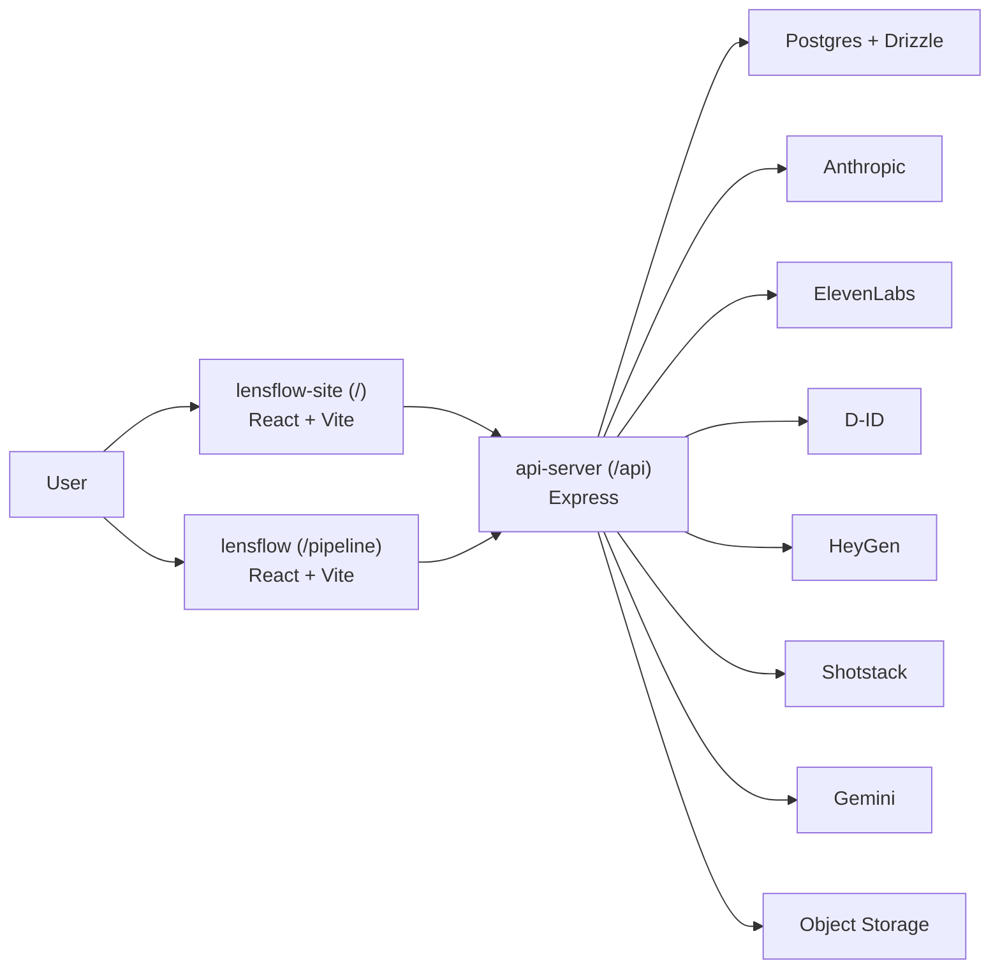

# AGENTS.md
This file provides guidance to Verdent when working with code in this repository.

## Table of Contents
1. Commonly Used Commands
2. High-Level Architecture & Structure
3. Key Rules & Constraints
4. Development Hints

## Commands
- `corepack pnpm run typecheck` - full workspace typecheck
- `corepack pnpm run build` - typecheck libs, then build all packages that define a build script
- `corepack pnpm --filter @workspace/api-server run build` - build the Express API bundle
- `corepack pnpm --filter @workspace/api-server run start` - start the built API server
- `corepack pnpm --filter @workspace/api-spec run codegen` - regenerate API hooks and Zod schemas from OpenAPI
- `corepack pnpm --filter @workspace/db run push` - push Drizzle schema changes in dev
- `C:\Users\User\Projects\lensflow\lensflow\node_modules\.bin\tsc.cmd -p C:\Users\User\Projects\lensflow\lensflow\artifacts\api-server\tsconfig.json --noEmit` - targeted API typecheck on Windows when workspace scripts are blocked
- `C:\Users\User\Projects\lensflow\lensflow\node_modules\.bin\tsc.cmd -p C:\Users\User\Projects\lensflow\lensflow\artifacts\lensflow-site\tsconfig.json --noEmit` - targeted marketing-site typecheck on Windows

## Architecture
- Monorepo with three main runtime surfaces:
  - `artifacts/lensflow-site/` - marketing site served at `/`
  - `artifacts/lensflow/` - pipeline app served at `/pipeline/`
  - `artifacts/api-server/` - Express API served at `/api`
- Contract-first API flow:
  - OpenAPI source lives in `lib/api-spec/openapi.yaml`
  - generated client hooks live in `lib/api-client-react/`
  - generated schemas live in `lib/api-zod/`
- Persistent data is in Postgres via Drizzle:
  - `lib/db/src/schema/jobs.ts` is the critical schema for jobs and pipeline steps
- Core job lifecycle runs in `artifacts/api-server/src/routes/jobs.ts`:
  - create job → create pipeline steps → `runSimulation(jobId)` executes steps
  - steps include scrape, enhancement/upgrades, script, voiceover, presenter video, and Shotstack composition
- Media providers:
  - Anthropic generates scripts
  - ElevenLabs generates voiceover
  - D-ID is primary presenter-video path, HeyGen is fallback
  - Shotstack composes final video
  - Gemini handles photo enhancement
- [inferred] Current deployment expectation is a single Express process serving API plus both built Vite frontends; built frontend outputs already exist under each app's `dist/public`.
- Development entry points:
  - `artifacts/api-server/src/index.ts`
  - `artifacts/api-server/src/app.ts`
  - `artifacts/lensflow-site/vite.config.ts`
  - `artifacts/lensflow/vite.config.ts`

## Key Rules & Constraints
- Never run `pnpm dev` at workspace root; use package-specific commands or the hosted workflow.
- On Windows, workspace `pnpm` flows may fail because root `preinstall` uses `sh`; prefer targeted `tsc` or existing installed artifacts unless you are on the intended hosted environment.
- `inputMode: "selfie"` is intentionally free-text and not a strict DB enum; do not "fix" it into a migration without checking mobile flows.
- `pipelineStepsTable.outputData` is a manually added text column relied on by the pipeline; preserve it in any schema/codegen work.
- `generate_script` stores the raw script in `outputData`, and `runSimulation()` also passes `generatedScript` in memory to later steps; avoid refactors that remove either path without replacing both.
- `POST /storage/uploads/request-url` requires auth, and `/jobs/self-recorded` only accepts storage-backed `/api/storage/` URLs.
- Shotstack gotchas already encoded in code must be preserved: use `shape` instead of removed `colour`, use `fade` instead of `fadeIn`/`fadeOut`, and avoid stale HeyGen CDN URLs by using fresh or mirrored media.
- `artifacts/api-server/src/app.ts` is responsible for serving `/api`, `/pipeline`, and the marketing site root; changes here can take the whole product offline.
- Morgan voice handling is fragile: `replit.md` documents Morgan as `g5fH9S068t9I3i8Y9u4`; verify whether a code path expects a voice ID or a display name before changing TTS behavior. [inferred]

## Development Hints
- Adding a new API endpoint:
  - update `lib/api-spec/openapi.yaml`
  - regenerate code with the API spec package
  - implement the route under `artifacts/api-server/src/routes/`
  - wire any shared validation/types from generated `lib/api-zod`
- Modifying CI/CD pipeline:
  - check `.replit` first; deployment routes external port 80 to local port 8080 and assumes an application router
  - verify the API server still serves built frontend assets after any deployment/startup change
- Extending subsystems:
  - pipeline behavior usually starts in `artifacts/api-server/src/routes/jobs.ts`
  - media-provider-specific logic lives in `artifacts/api-server/src/lib/`
  - UI changes often require coordinated updates in both `artifacts/lensflow-site/` and `artifacts/lensflow/`