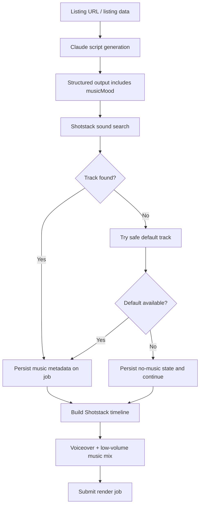

## Objective
Add automatic background music selection and low-volume mixing to the existing LensFlow video generation pipeline, following current Shotstack and script-generation patterns in the codebase.

## Scope
Implement end-to-end support for:
- deriving a **music mood** from the listing/script via Claude
- searching Shotstack `/v3/audio/sounds` semantically for a matching track
- persisting selected music metadata on the job
- mixing music under voiceover in the Shotstack timeline with conservative levels and fades
- graceful fallback behavior that never blocks render generation
- logging selection and final mix settings
- validating with a live run for the provided listing and a final typecheck

## Planned Changes

### 1) Review and extend the script-generation contract
**Targets**
- `C:\Users\User\Projects\lensflow\lensflow\artifacts\api-server\src\lib\shotstack.ts`
- script generation / Claude prompt pipeline files under `C:\Users\User\Projects\lensflow\lensflow\artifacts\api-server\src\...`
- job model / persistence files where script and render metadata are stored

**Actions**
- Identify where Claude currently returns structured script metadata.
- Extend the structured output schema to include `musicMood` with allowed values:
  - `luxury`, `cinematic`, `calm`, `coastal`, `family`, `upbeat`, `prestige`, `modern`
- Keep the mood optional at runtime so failures in extraction do not block downstream processing.
- Reuse existing validation/parsing patterns already used for script fields.

**Why**
This keeps mood selection aligned with the existing AI-driven script pipeline instead of introducing a disconnected heuristic layer.

### 2) Add Shotstack sound search integration
**Targets**
- `C:\Users\User\Projects\lensflow\lensflow\artifacts\api-server\src\lib\shotstack.ts`
- any existing HTTP client/helper used for Shotstack requests

**Actions**
- Add a helper to query Shotstack `/v3/audio/sounds` using the selected mood and, if useful, listing/script context terms.
- Normalize the response into an internal music-track shape containing:
  - `mood`
  - `trackId`
  - `trackName`
  - `url` (preview/source URL actually used)
  - `provider`
- Rank/select the safest usable result using minimal deterministic logic consistent with existing code style.
- Add a predefined safe default track fallback.
- If both search and default fallback fail, return `null` and continue without music.

**Decision already clarified**
Primary fallback path will be: **predefined safe default track first, then skip gracefully if unavailable**.

### 3) Persist music metadata on the job
**Targets**
- job entity/schema/model files
- job creation/update service files
- any API response DTOs that expose render/job metadata

**Actions**
- Add a job-level music metadata object or fields for:
  - `mood`
  - `trackId`
  - `trackName`
  - `url`
  - `provider`
- Persist the selected track before or alongside render submission, following the existing job update lifecycle.
- Ensure null-safe behavior when no track is selected.

**Why**
This supports observability, debugging, and the requested final report output.

### 4) Mix background music into the Shotstack timeline
**Targets**
- `C:\Users\User\Projects\lensflow\lensflow\artifacts\api-server\src\lib\shotstack.ts`
- any timeline builder/composition helpers

**Actions**
- Add a background audio asset/clip to the Shotstack payload when a track is available.
- Keep music at a conservative base volume under narration.
- Apply clean fade-in/fade-out settings.
- If the current timeline builder supports per-clip audio controls, use those directly.
- If explicit ducking automation is not available in the current integration layer, implement the safest equivalent supported by the existing Shotstack payload model:
  - low fixed music volume under voiceover
  - voiceover kept at normal/intended level
  - fades to avoid abrupt starts/stops
- Ensure music duration aligns safely with the video duration.

**Constraint**
Music must never overpower speech, so the implementation will prefer conservative levels over aggressive loudness.

### 5) Add resilient logging and failure isolation
**Targets**
- generation orchestration/service files
- `shotstack.ts`
- any existing logger wrapper

**Actions**
- Log:
  - selected mood
  - selected track id/name/provider/url
  - final configured music volume / mix settings
  - fallback/skip reason when selection fails
- Wrap music selection and timeline insertion so exceptions do not fail the overall video generation job.
- Preserve existing error-handling conventions.

### 6) Live end-to-end validation with the provided listing
**Targets**
- existing job creation/test harness/CLI/API route used to generate a video from a listing URL

**Actions**
- Run the normal generation flow for:
  - `https://www.realestate.com.au/property-house-vic-richmond-141826448`
- Capture and report:
  - Job ID
  - selected music mood
  - selected track name
  - selected track/source URL
  - confirmation that the Shotstack payload includes music
  - final MP4 URL
  - whether voiceover remains clear
- Because you asked to assume credentials are configured, the plan will use the live path rather than a mock-only path.

### 7) Final verification
**Actions**
- Run the required typecheck exactly from:
  - `C:\Users\User\Projects\lensflow\lensflow\artifacts\api-server`
  - command: `npx tsc --noEmit`
- If the repo has a targeted generation/test command already used for this pipeline, run that as part of validation as well.

## Architecture / Flow

## Verification / Definition of Done
- Claude output includes one of the allowed music moods.
- Shotstack sound search is integrated and returns a normalized track selection when available.
- Job metadata stores mood + track details.
- Shotstack payload includes a background music audio clip when a track is selected.
- Music selection failures do not block render generation.
- Logs include mood, track, and final mix volume/settings.
- Live run for the provided listing completes and yields the requested report fields.
- `npx tsc --noEmit` passes in `C:\Users\User\Projects\lensflow\lensflow\artifacts\api-server`.

## Traceability Matrix
| Step | Targets | Verification |
|---|---|---|
| 1. Extend script contract | Claude/script pipeline files | Structured output contains valid `musicMood` |
| 2. Add sound search | `shotstack.ts`, HTTP helpers | Search/default selection returns normalized track or null |
| 3. Persist metadata | job schema/service files | Job record exposes stored music fields |
| 4. Mix into timeline | `shotstack.ts`, timeline builder | Shotstack payload contains music clip with low volume/fades |
| 5. Add resilience/logging | orchestration + logger usage | Failures logged and render still proceeds |
| 6. Live validation | generation entrypoint | Requested job/render/music details captured |
| 7. Typecheck | api-server TS project | `npx tsc --noEmit` succeeds |
