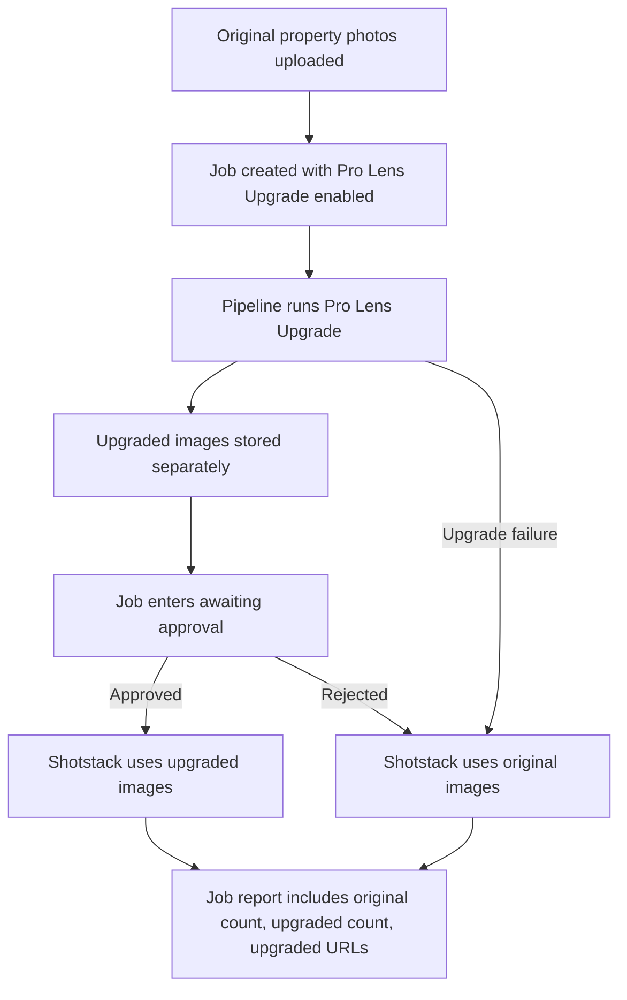

# Objective
Implement **Pro Lens Upgrade** as a separate, compliance-safe photo enhancement feature in `C:\Users\User\Projects\lensflow\lensflow`, following the existing **AI Room Rescue** pipeline patterns while keeping the property truthful and unchanged.

## Chosen approach
- **Primary engine:** Gemini image generation/editing as the main enhancement path.
- **Fallback:** If enhancement fails for any image, preserve and continue with the original image.
- **Pattern source:** Reuse the existing Room Rescue architecture for:
  - pipeline step ordering
  - separate storage of transformed assets
  - approval gating
  - fallback-to-original behavior
  - job-level reporting fields

## Why this approach
- The codebase already contains a `pro-lens-upgrade` backend module and pipeline hooks adjacent to Room Rescue, so extending that path is lower-risk and more consistent than introducing a new Sharp-first subsystem.
- Gemini better matches the requested corrections bundle in one pass: lens correction, perspective cleanup, exposure balancing, colour temperature balancing, dynamic range recovery, and realistic premium presentation.
- The existing pipeline already supports approval pauses and alternate image sets, which fits the requested human approval step.

## Scope of changes

### 1) Backend pipeline alignment and hardening
**Targets**
- `C:\Users\User\Projects\lensflow\lensflow\artifacts\api-server\src\lib\pro-lens-upgrade.ts`
- `C:\Users\User\Projects\lensflow\lensflow\artifacts\api-server\src\routes\jobs.ts`
- `C:\Users\User\Projects\lensflow\lensflow\artifacts\api-server\src\routes\dev.ts`

**Planned changes**
- Review and tighten the existing Pro Lens prompt so it remains explicitly separate from Room Rescue and enforces:
  - truthful enhancement only
  - no defect removal
  - no layout/size changes
  - no furniture/view/fixture replacement
- Confirm the pipeline step ordering mirrors the intended behavior:
  1. original image upload/storage
  2. Pro Lens Upgrade execution
  3. upgraded image stored separately
  4. approval wait state
  5. Shotstack uses approved upgraded images
  6. fallback to originals if rejected or failed
- Ensure the step output text/reporting includes:
  - original image count
  - upgraded image count
  - upgraded image URLs
  - explicit fallback wording when originals are used
- Verify reset/simulation paths clear Pro Lens approval state and upgraded image arrays consistently.

**Validation**
- Confirm job route logic uses upgraded images only after approval.
- Confirm rejection/failure paths continue with originals and do not block video generation.

---

### 2) API contract and job payload wiring
**Targets**
- `C:\Users\User\Projects\lensflow\lensflow\lib\db\src\schema\jobs.ts`
- any generated/shared API types already consumed by mobile/web job screens

**Planned changes**
- Verify the schema fields already present for Pro Lens are sufficient:
  - `proLensImages`
  - `proLensUpgradedCount`
  - `proLensApproved`
- If needed, expose any missing fields through the API response shape so both mobile and web can render:
  - before/after previews
  - approval CTA state
  - report counts and URLs
- Keep the feature separate from `enhancedImages` and separate from Room Rescue fields.

**Validation**
- Confirm `GET /jobs/:id` returns all Pro Lens fields needed by both clients.

---

### 3) New Job form toggle in mobile app
**Targets**
- `C:\Users\User\Projects\lensflow\lensflow\artifacts\lensflow-mobile\app\(tabs)\create.tsx`

**Planned changes**
- Add a **Pro Lens Upgrade** toggle in the New Job form using the same interaction pattern as the existing photo enhancement / Room Rescue-style toggles.
- Keep it visually distinct with a different accent color from Room Rescue.
- Restrict it to the photo-based flow where property images are uploaded.
- Submit the toggle value in job creation payload so the backend includes/excludes the `pro_lens_upgrade` step.
- Update helper copy to explain:
  - realistic professional correction
  - no structural or cosmetic deception
  - approval required before upgraded images are used

**Validation**
- Confirm the toggle only appears when relevant.
- Confirm the create-job payload includes the Pro Lens flag when enabled.

---

### 4) Mobile before/after approval experience
**Targets**
- `C:\Users\User\Projects\lensflow\lensflow\artifacts\lensflow-mobile\app\job\[id].tsx`
- related mobile components if extraction is cleaner

**Planned changes**
- Add a dedicated **Pro Lens Upgrade** review section when upgraded images exist.
- Show paired **before/after** previews using:
  - original `propertyImages`
  - upgraded `proLensImages`
- Add approval/rejection actions wired to the existing endpoints:
  - `POST /jobs/:id/approve-upgrade`
  - `POST /jobs/:id/reject-upgrade`
- Reflect current state clearly:
  - awaiting approval
  - approved
  - rejected
  - fallback/originals used
- Ensure the general photo display uses approved upgraded images only after approval; otherwise originals remain primary.

**Validation**
- Confirm approval updates the UI state and final displayed photo set.
- Confirm rejection preserves originals and pipeline continues.

---

### 5) Web job/reveal UI before/after approval experience
**Targets**
- web job/reveal components under `C:\Users\User\Projects\lensflow\lensflow\artifacts\lensflow-site\src`
- likely job/pending/reveal-related components once exact render location is confirmed during implementation

**Planned changes**
- Add the same Pro Lens review pattern to the web experience:
  - before/after preview
  - approval/rejection controls
  - status messaging
- Reuse the same backend approval endpoints and job fields as mobile.
- Keep the visual treatment distinct from Room Rescue, with a separate accent color and copy focused on photographic correction rather than transformation.

**Validation**
- Confirm the web UI renders the review state from job data.
- Confirm approval/rejection actions update the job and refresh the displayed image set.

---

### 6) Reporting and Shotstack source selection
**Targets**
- `C:\Users\User\Projects\lensflow\lensflow\artifacts\api-server\src\routes\jobs.ts`
- any Shotstack composition helpers if image source selection is delegated there

**Planned changes**
- Ensure Shotstack receives:
  - approved upgraded images when approved
  - originals when rejected or when upgrade fails
- Ensure job step output/report text includes:
  - original count
  - upgraded count
  - URLs for upgraded images
- Preserve graceful continuation even if zero images are upgraded.

**Validation**
- Confirm the effective photo array passed downstream matches approval/fallback state.
- Confirm report text is visible in the pipeline/job detail response.

---

### 7) Test fixture, automated coverage, and typecheck
**Targets**
- existing test locations if present in the repo for API/mobile/web
- fixture image location under project assets/public/test-support area, chosen to match existing conventions

**Planned changes**
- Add one poor-quality phone-style property image fixture for Pro Lens verification.
- Add automated coverage where the repo already supports it, focused on:
  - fallback behavior when upgrade fails
  - approval gating behavior
  - report/count generation
- Add a manual QA fixture path and verification notes for before/after review in both mobile and web.
- Run full requested typecheck after implementation.

**Validation**
- Run targeted checks first, then `typecheck` for the workspace/package scope that covers changed code.

## Data flow

## Constraints to preserve
- Pro Lens Upgrade must remain **separate from AI Room Rescue**.
- No defect removal or concealment.
- No room resizing, layout changes, fake furniture, fake views, fixture replacement, or structural edits.
- Originals must remain stored and available independently.
- Approval is required before upgraded images become the source for video composition.
- Failure must never block video completion.

## Definition of done
- New Job form includes a distinct Pro Lens Upgrade toggle.
- Backend runs Pro Lens Upgrade as a separate pipeline step and stores outputs separately.
- Mobile and web both show before/after review with approve/reject actions.
- Shotstack uses approved upgraded images only.
- Fallback to originals works on rejection or failure.
- Job report includes original count, upgraded count, and URLs.
- One poor-quality property image fixture is added for testing/QA.
- Typecheck passes.

## Traceability
| Step | Targets | Verification |
|---|---|---|
| Backend hardening | `artifacts/api-server/src/lib/pro-lens-upgrade.ts`, `artifacts/api-server/src/routes/jobs.ts`, `artifacts/api-server/src/routes/dev.ts` | Pipeline uses approval/fallback correctly |
| API/schema wiring | `lib/db/src/schema/jobs.ts` and exposed job payloads | Job response contains Pro Lens fields |
| Mobile toggle | `artifacts/lensflow-mobile/app/(tabs)/create.tsx` | Toggle appears and submits flag |
| Mobile approval UI | `artifacts/lensflow-mobile/app/job/[id].tsx` | Before/after + approve/reject works |
| Web approval UI | `artifacts/lensflow-site/src/...` relevant job/reveal files | Before/after + approve/reject works |
| Reporting/Shotstack | `artifacts/api-server/src/routes/jobs.ts` and related helpers | Correct image source and report output |
| Tests/typecheck | existing test locations + fixture asset | Automated checks and typecheck pass |